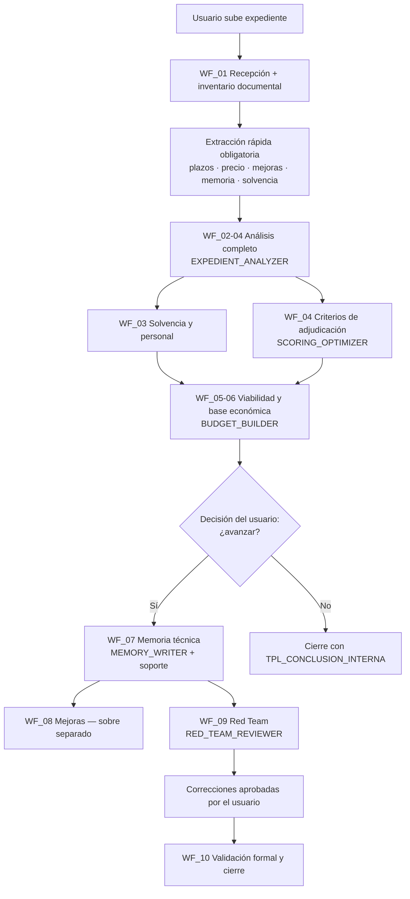

# MAPA DEL SISTEMA — Sistema Experto de Licitaciones Turísticas

> **Propósito:** ofrecer una vista completa de la arquitectura del sistema, sus módulos y sus relaciones.
> **Cuándo cargarlo:** al instalar el sistema, al dudar sobre qué módulo utilizar o al mantener/ampliar el sistema.
> **Cuándo no cargarlo:** durante el trabajo operativo sobre un expediente concreto.
> **Skills que lo utilizan:** 00_KNOWLEDGE_ROUTER (como referencia de enrutado).
> **Palabras clave:** mapa, arquitectura, módulos, estructura del sistema.
> **Dependencias:** ninguna.
> **Prioridad:** media. **Coste de contexto:** bajo.
> **Resumen:** este documento describe la arquitectura completa del sistema: instrucciones centrales, 15 Skills, 11 workflows, 18 documentos de conocimiento, 11 playbooks turísticos, 16 plantillas, 8 checklists, 5 ejemplos y los metadatos de build. Explica qué hace cada capa, cómo se relacionan entre sí y cuál es el flujo de información desde que el usuario sube un expediente hasta que se entrega una memoria revisada. Sirve de referencia de navegación y de guía para el mantenimiento del sistema.

---

## 1. Visión general

El sistema convierte a Claude en un **consultor senior de contratación pública española especializado en licitaciones del sector turístico**. Trabaja por capas:

| Capa | Carpeta | Función |
|---|---|---|
| Gobierno | `01_PROJECT_INSTRUCTIONS/` | Reglas permanentes: rol, jerarquía de fuentes, reglas inviolables, formato por defecto. Se copia en las instrucciones del Project. |
| Orquestación | `02_SKILLS/00_KNOWLEDGE_ROUTER.md` + `03_WORKFLOWS/` | Decide qué Skills y documentos cargar en cada fase y en qué orden. |
| Capacidades | `02_SKILLS/` | 14 Skills especializadas con responsabilidad única (análisis, presupuesto, memoria, scoring, red team, visuales, etc.). |
| Conocimiento | `04_KNOWLEDGE/` + `05_PLAYBOOKS_TURISMO/` | Metodologías y doctrina de dominio, cargadas selectivamente. |
| Producción | `06_TEMPLATES/` + `07_CHECKLISTS/` + `08_OUTPUT_EXAMPLES/` | Formatos de salida, controles de calidad y ejemplos calibrados. |
| Build | `09_BUILD/` | Manifiesto, índice, guía de carga de contexto, changelog y validación. |

## 2. Flujo principal (de expediente a oferta)

Puntos no negociables del flujo:
- La **extracción rápida** siempre precede al análisis completo.
- La **base económica** siempre precede a la redacción de la memoria.
- La **decisión de avanzar o desestimar es siempre del usuario** (regla inviolable n.º 11).
- El **Red Team nunca reescribe en silencio**: señala y propone.

## 3. Módulos por carpeta

### 01_PROJECT_INSTRUCTIONS
- `CLAUDE_PROJECT_INSTRUCTIONS.md` — versión recomendada, lista para copiar en el Project.
- `VERSION_CORTA.md` — mínima, para Projects con muchas instrucciones propias.
- `VERSION_COMPLETA.md` — extendida, para consulta y auditoría.
- `REGLAS_INVIOLABLES.md` — las 20 reglas transversales; el resto de archivos las referencia, no las repite.

### 02_SKILLS (responsabilidad única)
| # | Skill | Responsabilidad |
|---|---|---|
| 00 | KNOWLEDGE_ROUTER | Clasificar la petición, seleccionar Skills/documentos, impedir saltos de fase. |
| 01 | EXPEDIENT_ANALYZER | Extraer y estructurar todo el contenido del expediente. |
| 02 | BUDGET_BUILDER | Convertir obligaciones en costes y escenarios económicos. |
| 03 | MEMORY_WRITER | Redactar la memoria técnica trazada contra criterios. |
| 04 | SCORING_OPTIMIZER | Matriz criterio→evidencia→acción; separación de sobres. |
| 05 | RED_TEAM_REVIEWER | Revisión adversarial clasificada por severidad. |
| 06 | VISUAL_DESIGNER | Diagramas, cronogramas, RACI, SVG con valor informativo. |
| 07 | GOVERNANCE_DESIGNER | Roles, comités, escalado, interlocución. |
| 08 | PLANNING_ENGINE | Fases, dependencias, ruta crítica, hitos. |
| 09 | RISK_MANAGER | Matriz de riesgos con prevención y contingencia. |
| 10 | DELIVERABLES_GENERATOR | Fichas de entregables con criterios de aceptación. |
| 11 | KPI_GENERATOR | Indicadores con fórmula, meta, umbral y acción correctora. |
| 12 | TOURISM_PLAYBOOKS | Selección y aplicación del playbook sectorial adecuado. |
| 13 | SPANISH_PROCUREMENT_EXPERT | Interpretación LCSP sin sustituir asesoramiento jurídico. |
| 14 | EDITORIAL_WRITER | Pulido editorial sin alterar significado técnico. |

### 03_WORKFLOWS
`WF_MASTER.md` define los 18 estados (0–17) del ciclo de vida completo y las transiciones permitidas y prohibidas. Los WF_01–WF_10 desarrollan cada tramo operativo.

### 04_KNOWLEDGE
18 documentos metodológicos (análisis de expedientes, arquitectura de memorias, ingeniería de evidencias y entregables, optimización de juicio de valor, solvencia, personal, presupuestación, riesgos, gobernanza, planificación, KPIs, calidad, transferencia, visuales, redacción editorial y contratación pública española). Se cargan **solo** cuando su materia es objeto de la petición.

### 05_PLAYBOOKS_TURISMO
11 playbooks por tipología de contrato turístico (DTI, planificación, marketing, observatorios, eventos, transformación digital, fondos europeos, oficinas técnicas, participación, comunicación y patrones por tipo de contrato). Se carga **solo el playbook que corresponde al objeto del contrato**.

### 06_TEMPLATES / 07_CHECKLISTS / 08_OUTPUT_EXAMPLES
Plantillas de salida (extracción rápida, matrices, base económica, memoria, cronograma, RACI, riesgos, KPIs, red team, conclusión interna), checklists de control por fase y ejemplos calibrados de salida real.

### 09_BUILD
- `MANIFEST.json` — metadatos de todos los módulos (activación, dependencias, coste de contexto).
- `FILE_INDEX.md` — índice maestro legible.
- `CONTEXT_LOADING_GUIDE.md` — estrategia de recuperación selectiva.
- `CHANGELOG.md` y `VALIDATION_REPORT.md`.

## 4. Reglas de carga de contexto (resumen)

1. Nunca se carga toda la base documental: el Router selecciona por fase y materia.
2. Cada documento declara en cabecera cuándo cargarlo y cuándo no.
3. Máximo orientativo por turno: instrucciones + 1 workflow + 2-3 Skills + 2-3 documentos de conocimiento + 1 playbook + plantillas necesarias.
4. Exclusiones típicas: sin visuales en análisis de solvencia; sin presupuesto al redactar un índice; sin legislación si no hay cuestión jurídica; sin Red Team en primera lectura; sin playbooks ajenos al objeto del contrato.

Detalle completo en `09_BUILD/CONTEXT_LOADING_GUIDE.md`.

## 5. Mantenimiento

- Todo archivo nuevo se registra en `MANIFEST.json` y `FILE_INDEX.md`.
- Toda modificación relevante se anota en `CHANGELOG.md`.
- Las reglas transversales viven únicamente en `REGLAS_INVIOLABLES.md`; los demás módulos las citan por número.
- Cuando se incorporen memorias de referencia reales (Ágora, Gran Tour Cáceres, etc.), abstraer sus patrones en `04_KNOWLEDGE` y `05_PLAYBOOKS_TURISMO`, nunca copiarlas.
