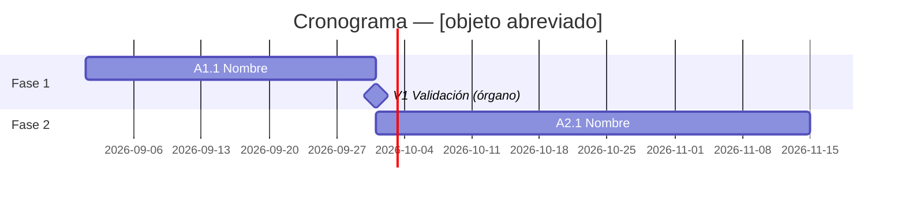

# TPL_CRONOGRAMA — Formato de cronograma

> **Propósito:** formato de cronograma en tabla y en Gantt (mermaid) coherentes entre sí.
> **Cuándo cargarlo:** producción de cronogramas (Skills 08 y 06).
> **Skills:** 08_PLANNING_ENGINE, 06_VISUAL_DESIGNER. **Prioridad:** alta. **Coste:** bajo.
> **Resumen:** doble formato (tabla mensual de barras y Gantt mermaid) generado desde los datos del plan de trabajo; hitos y validaciones visibles; reglas de coherencia texto↔visual.

---

## Formato tabla (para memorias con restricciones de formato)

| Actividad | M1 | M2 | M3 | M4 | M5 | M6 | … |
|---|---|---|---|---|---|---|---|
| A1.1 [nombre] | █ | █ | | | | | |
| V1 Validación diagnóstico | | | ◆ | | | | |
| A2.1 [nombre] | | | | █ | █ | | |

Leyenda: █ ejecución · ◆ hito/validación · ░ actividad recurrente

## Formato Gantt (mermaid)

Sin fecha de formalización: usar meses relativos en la tabla y fechas convencionales declaradas como relativas en el Gantt («M1 = mes de formalización»).

## Reglas de uso

Generado SIEMPRE desde TPL_PLAN_DE_TRABAJO (nunca dibujar primero) · hitos del pliego destacados · validaciones del órgano visibles · ruta crítica destacable (color/negrita con leyenda) · legible impreso y en B/N (K-16 §3) · sin revelar plazos ofertados como criterio automático (RI-05).
